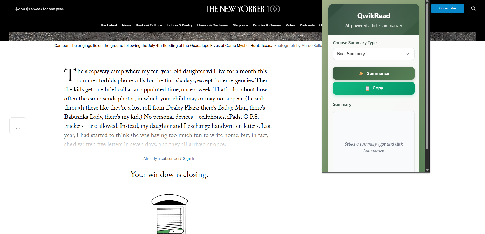

# QwikRead – AI Article Summarizer Chrome Extension

> QwikRead is a lightweight, AI-powered Chrome extension that helps you summarize articles instantly while browsing. With just one click, it extracts the content from the page you're on and delivers a concise summary—tailored to your preferred format.

---

## 🚀 Features

- 🧠 AI-generated summaries using Gemini 1.5 Flash
- 📝 Multiple summary types: Brief, Detailed, Bulleted, Headlines
- 🪄 Clean and responsive UI
- 🔑 API Key secure storage via Chrome Extension storage
- 📋 One-click copy summary to clipboard

---

## ⚙️ Technologies Used

- HTML, CSS
- Vanilla JavaScript
- Chrome Extensions API (Manifest V3)
- Google Gemini API (v1beta, model: `gemini-1.5-flash`)

---

## 🛠️ Setup & Installation

1. **Clone the repository**

```bash
git clone https://github.com/YOUR_USERNAME/qwikread-ai-extension.git
cd qwikread-ai-extension
```

2. **Get a Gemini API Key**

   - Visit [Google AI Studio](https://makersuite.google.com/app/apikey)
   - Create and copy your free API key

3. **Load into Chrome**

   - Go to `chrome://extensions`
   - Enable **Developer Mode**
   - Click **"Load unpacked"** and select the project folder

4. **Set your API Key**
   - Click the extension icon → **Options**
   - Paste your Gemini API key and save

---

## 🧪 Usage

1. Navigate to any blog/article/webpage
2. Click on the **QwikRead** Chrome extension
3. Choose your summary type (e.g., Brief, Bulleted, Detailed, Headlines only)
4. Click **Summarize** ✨
5. Click **Copy** to save it to clipboard

---

## 🔐 Secure API Storage

QwikRead stores your Gemini API key using `chrome.storage.sync` – it never exposes your key in code or UI.

---

## 📄 License

This project is licensed under the [MIT License](LICENSE).

---

## 🙌 Acknowledgements

- [Google AI Studio](https://makersuite.google.com/)
- [Chrome Extensions Docs](https://developer.chrome.com/docs/extensions/)

---

## 📸 Screenshots

Popup UI




---

This project is licensed under the [MIT License](./LICENSE).

---

## ⭐️ Show Your Support

If you find this project helpful, feel free to ⭐️ the repo and share it!

---
