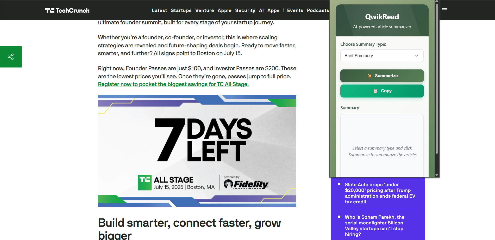
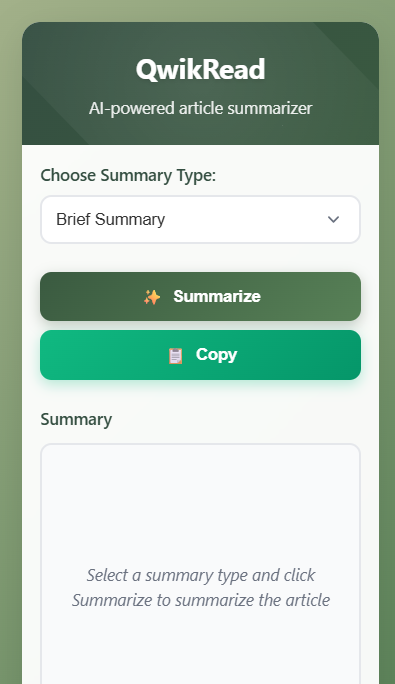

# 🌐 QwikRead – AI Article Summarizer Chrome Extension

> **QwikRead** is a lightweight, AI-powered Chrome extension that instantly summarizes articles with a single click. It uses [OpenRouter](https://openrouter.ai) with Google’s Gemini 2 Flash model to deliver clean, fast, and context-aware summaries—right in your browser.

---

## 🚀 Features

- 📰 Summarize any article on the web instantly
- ✍️ Choose from: **Brief**, **Detailed**, **Bulleted**, or **Headlines-only** formats
- ⚡ Powered by **Google Gemini 1.5 Flash** via **OpenRouter API**
- 🧠 AI summaries with customizable temperature and length
- 📋 One-click **Copy** to Clipboard
- 🔒 Fully local: No user data is sent anywhere

---

## 🛠️ Built With

- HTML, CSS, JavaScript
- Chrome Extensions API (**Manifest v3**)
- [OpenRouter.ai](https://openrouter.ai) API (model: `google/gemini-1.5-flash`)

---

## ⚙️ Setup Instructions

### 1. Clone the Repository

```bash
git clone https://github.com/YOUR_USERNAME/qwikread-ai-extension.git
cd qwikread-ai-extension
```

---

### 2. Get an OpenRouter API Key

- Visit [https://openrouter.ai](https://openrouter.ai)
- Sign in and generate a free API key

---

### 3. Load the Extension into Chrome

1. Go to `chrome://extensions`
2. Enable **Developer mode**
3. Click **"Load unpacked"**
4. Select the `qwikread-ai-extension` folder

---

### 4. Set Up the API Key

- Click the extension icon → **Options**
- Paste your OpenRouter API key and click **Save**

---

## 🧪 How to Use

1. Open any article or blog post
2. Click the **QwikRead** extension icon
3. Choose your desired summary format:
   - Brief (3 lines)
   - Detailed (5–7 lines)
   - Bulleted points
   - Headlines (all caps)
4. Click **Summarize** ✅
5. Click **Copy** to grab the summary text to clipboard

---

## 🔐 Security & Privacy

- Your API key is securely stored via `chrome.storage.sync`
- No article text or user info is logged or stored
- Entire processing happens client-side + OpenRouter (no middle server)

---

## 🖼 Screenshots





---

## 📄 License

This project is licensed under the [MIT License](./LICENSE).

---

## 🙌 Acknowledgements

- [OpenRouter](https://openrouter.ai) – AI API Gateway
- [Google Gemini](https://deepmind.google/technologies/gemini/)
- [Chrome Extensions Documentation](https://developer.chrome.com/docs/extensions/)

---

## ⭐ Show Your Support

If you like this project, please consider giving it a ⭐ on GitHub and sharing it with friends!

---
